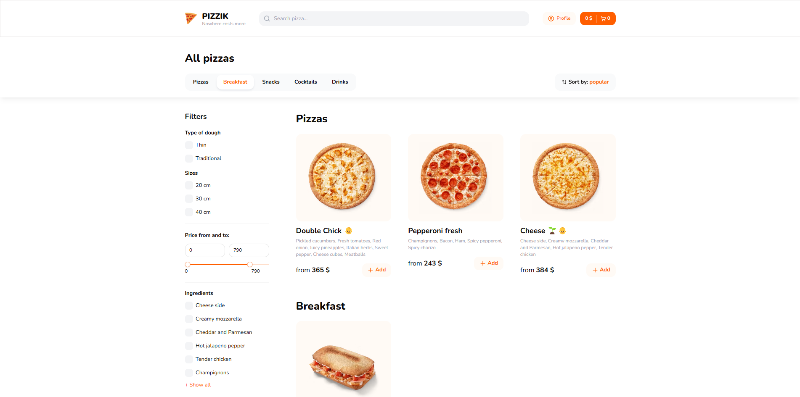

<h1 align = "center">
     
     
    🍕 Pizzik 🍕
     
     
</h1>

    🍕 Pizzik site is a project to create an appealing, user-friendly online platform where customers can easily order pizza. The site features a menu with mouth-watering photos, detailed descriptions of each dish, options to add ingredients, and a streamlined ordering process. 🍕

<h3>Main features:</h3>

 - NextJS (Parallel Routes, Group Routes, Server Actions, API)
 - TypeScript
 - TailwindCSS + ShadCN
 - NextAuth
 - React Hook Form + Zod
 - Zustand
 - react-use
 - nextjs-toploader
 - lucide-react
 - Resend